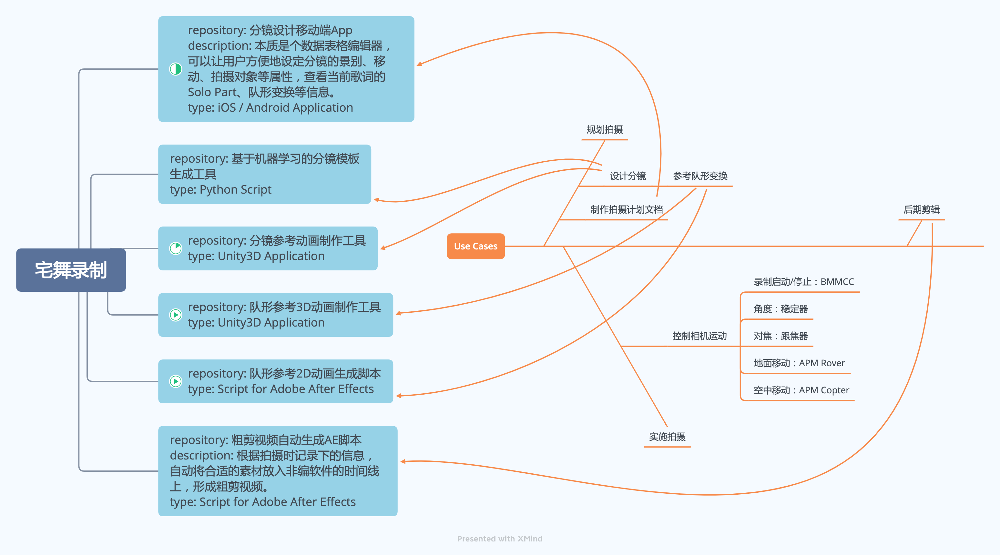

# 宅舞录制系统 总述

创建一套全流程的解决方案，自动化完成宅舞拍摄的设计到实施。

初始由用户提供歌词，以及角色的位置变换数据。
根据歌词结构自动设计分镜。其中主要包括在哪句时、从什么角度、拍哪些角色。
在Unity中导入人物模型和舞蹈动作，模拟角色的跳舞过程，根据导入设计出的镜头运动数据，控制Unity内的相机，完成录制模拟。
将镜头运动数据传输至拍摄车，使用拍摄车来实现自动拍摄。
后期制作时，根据拍摄时记录下的信息，自动将合适的素材放入非编软件的时间线上，形成粗剪视频。

## 分镜设计移动端App

type: iOS / Android Application
本质是个数据表格编辑器，可以让用户方便地设定分镜的景别、移动、拍摄对象等属性，查看当前歌词的Solo Part、队形变换等信息。

## 基于机器学习的分镜模板生成工具

type: Python Script

## 分镜参考动画制作工具

type: Unity3D Application

求最少需要拍几遍？

模型可简化为带权有向图。
顶点u = 一条摄像机录制轨迹
边<u,v> = u的终点到v的起点
边<v,u> = v的终点到u的起点
权 = 人移动距离
假设人移动速度为2m/s

## 队形参考3D动画制作工具

type: Unity3D Application

## 队形参考2D动画生成脚本

type: Script for Adobe After Effects

## 粗剪视频自动生成AE脚本

type: Script for Adobe After Effects

## 拍摄车控制

需要控制移动的路径，与移动的速度。
抛物线运动，是由水平方向的匀速直线运动与垂直方向的自由落体运动叠加形成。
